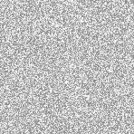
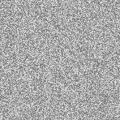

# Delite

Delite is a lightweight exposure detector for adjusting overexposed raw image data by reducing the overall pixel intensity. The resulting image is scaled down to an 8-bit .bmp file, such that it can be viewed on a standard display (there are only **256 shades** of gray available on most displays). Therefore, the output representation will incurr a precision loss in terms of color depth, but will suffice as a preview.

For example, the true nature of a CT image would be viewable on a dedicated display capable of showing full 16-bit grayscale rasters. Supposedly, you do not posses such a device at home. :)

Currently, there is support only for **16-bit grayscale** pixel data, which can be received as a file input via the `-f` flag. This bit depth level for grayscale images is required in areas such as advanced medical imaging or even in your normal day-to-day B&W scanning.

## Prerequisites

- GNU Make (> 3.x).
- A standard C compiler toolchain which supports the C99 standard (i.e. ISO/IEC 9899:1999).
- An image viewer (e.g. GIMP).

## Usage

### Building the project

```shell
git clone https://github.com/cristianfrasineanu/delite.git
cd $_
make
```
After executing these commands, the final executable will reside in the bin/ folder.

If you want to have it available globally, run `make install`.

### CLI usage

Flag | Details
---- | ----
-h | Display help message
-f | Raw pixel data file (must be *binary*)
-p | The first number of pixels to adjust for over exposure (default is 50)
-l | Adjustment level given as a percentage (default is 50%)
-o | Output preview file as a result of the adjustment (default is out.bmp)

The resulting pixel data will also be written to a separate binary file, named `altered.bin`, in the current directory.

Example:
Detect overexposed pixels by turning the first 50 pixels which have the highest value black:

```shell
delite -f demo/sendor_data.bin -l 100 -o adjusted.bmp
```

### Input format

The raw data that gets passed as an input must not exceed **2GB** in size. *libc* defaults to x86 (IA-32) for portability, hence the 2^32-1 limitation). 

The file must contain each pixel value encoded as a 16-bit value (from 0 to 65,535) and no other information beside it. Delite will strive to generate the downscaled image as a square bitmap (NxN). If the input length is not a perfect square, the final pixel array will be truncated.

The demo data set contains 45,000 random bytes in the 0x80-0xFF range (noise) and a separate file which contains two halves (one white and one gray). The final preview would be a 148x148 8-bit bitmap after running `delite`.

### Before & after





## Licensing

[GPLv3](https://choosealicense.com/licenses/gpl-3.0/)

*Feel free to contribute through a pull request or via the issue board*